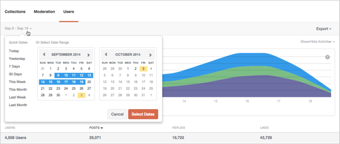
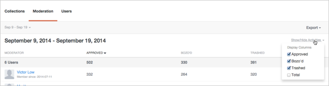
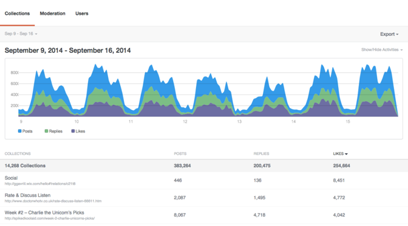
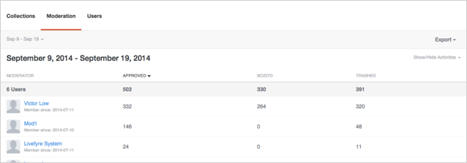
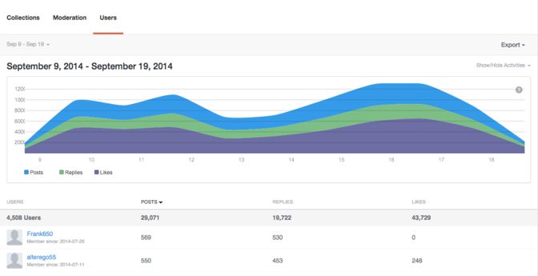

# Analytics{#analytics}

Analyze user, content, and moderator activity for your site.

## Analytics {#topic_22D8FAE581CD440EA02B1595520F60C2}

Analyze user, content, and moderator activity for your site. 

Livefyre Analytics provides access to your network data in easy to read dashboards for Conversations, Moderation and User data. Use these dashboards to monitor activity and run quick analyses on your site(s).

Dashboards may be filtered by site, date, and activity. Use the Network pulldown at the top left of the window to select a site to display. Once generated, click a column header to sort, or mouse over the graph for more specific information on any data point.

This page describes:

* Selecting a [Date Range](https://answers.livefyre.com/livefyre-studio-version-1/studio/analytics/#DateRange) for your dashboard 
* [Showing / Hiding Available Activities](https://answers.livefyre.com/livefyre-studio-version-1/studio/analytics/#ShowHideActivities) 
* [Exporting Dashboard Data](https://answers.livefyre.com/livefyre-studio-version-1/studio/analytics/#ExportDashboardData) 
* [The Collections Dashboard](https://answers.livefyre.com/livefyre-studio-version-1/studio/analytics/#CollectionsDashboard) 
* [The Moderation Dashboard](https://answers.livefyre.com/livefyre-studio-version-1/studio/analytics/#ModerationDashboard) 
* [The Users Dashboard](https://answers.livefyre.com/livefyre-studio-version-1/studio/analytics/#UsersDashboard)

>[!NOTE]
>
>Analytics currently support activities originating from Livefyre Core Apps and Moderation. Most activities included within these dashboards are also available through [Livefyre JavaScript Events](https://answers.livefyre.com/developers/reference/app-customizations/javascript-events/), which may be used to power your own custom or third-party analytics tool.

## Date Range {#concept_798C438120E643B6BE262C9997DC87C4}

Click the date pulldown to to select a range to display. Use the quick dates, or select a start and end date from the calendars provided.

Quick Dates:

* **Today:** Displays data from midnight the morning of the current day, until the last complete hour before this moment. 
* **Yesterday:** Displays the previous 24 hours' data. 
* **7 days:** Displays the previous 7 days' data, not including today. 
* **30 days:** Displays the previous 30 days' data, not including today. 
* **This Week:** Displays data from midnight the morning of last Sunday, until the last complete hour before this moment. 
* **This Month:** Displays data from midnight the morning of the first day of the current month, until the last complete hour before this moment. 
* **Last Week:** Displays last week's data. 
* **Last Month:** Displays last month's data.

## Showing/Hiding Activities {#concept_022D9851CBCE4A2FB80D0AE52A23744D}

Activities are actions that users take on your site, including commenting, flagging, sharing, and moderating. Use the **Show/Hide Activities** pulldown to select activities you wish to be included in your dashboard.

>[!NOTE]
>
>Selecting new events for the filter will re-render the page without changing the URL.

Available activities vary by dashboard type and export, and may include:

* **Posts:** Displays data from midnight the morning of the current day, until the last complete hour before this moment. 
* **Replies:** Displays the previous 24 hours' data. 
* **Likes:** Displays the previous 7 days' data, not including today. 
* **Unlikes:** Displays the previous 30 days' data, not including today. 
* **Contains Media:** Displays data from midnight the morning of last Sunday, until the last complete hour before this moment. 
* **Post has photo upload:** Displays data from midnight the morning of the first day of the current month, until the last complete hour before this moment. 
* **Post has link:** Displays last week's data. 
* **Post has @mentions:** Displays last month's data. 
* **Approved:** Displays last month's data. 
* **Bozo'd:** Displays last month's data. 
* **Trashed:** Displays last month's data. 
* **Moderation Total:** Displays last month's data.

## Exporting Dashboard Data {#concept_730DB61A9F894BE6BFB34E0E2A421ED3}

Use the **Export** pulldown menu to export your dashboard data as a CSV file.

* Daily Digest (Collections only): exports the last complete week's daily tallies for each Collection. 
* Table Data: exports all rolled-up Collections data (all columns and all rows in the current report). 
* Raw Data: exports all individual events that were used to create the current rolled-up report.

>[!NOTE]
>
>These reports may take a few minutes to export. All timestamps are Unix time.

## Collections {#concept_228D8E5553784DB8BABF3819A5FF0345}

The Collections dashboard lists user activity by Collection, allowing you to to determine your most (and least) engaging content. Each listed Collection includes a link to the page on which it can be found.

## Moderation {#concept_98689B1E804B43CEA21E3F456107CCD9}

The Moderation dashboard lists events by moderator, allowing you to evaluate their activity. Use this report to find your most active Moderators, and their most common moderation actions.

>[!NOTE]
>
>Automated Livefyre moderation activities will be listed for the moderator name Livefyre System.

## Users {#concept_D1A83E31C7B5467F9C844CBF9A740E12}

The Users dashboard shows site activity by user, allowing you to analyze how individual users are interacting with your site. Use this dashboard to find your most active users across your site, and to evaluate the most popular site activities.

