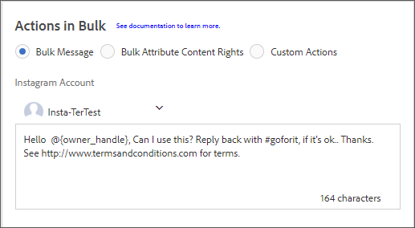

# Use Livefyre with AEM Assets

## Use Livefyre with AEM Assets {#concept_8CB825FA34F74B65A0F4D1747FB62FAC}Short Description
>[!NOTE]
>
>Screenshots were taken using the AEM 6.3 Touch UI.

>## Request Rights and Import UGC into AEM Assets {#task_5305AB1D5E3A49CD8DE4021EF6501C23}You can import Twitter and Instagram user-generated content (UGC) from Livefyre Studio to AEM Assets using the UGC Importer. After selecting the content you wish to import, you must then request rights to the content before the import can be completed.
>[!NOTE]
>
>Before using Assets to import UGC, you must set up Social Accounts and Rights Requests accounts in Livefyre Studio. See[Setting: Rights Requests](https://marketing.adobe.com/resources/help/en_US/livefyre/c_settings_rights_requests.html) for more information. 

To import UGC content into AEM Assets:

>1. From the AEM homepage, navigate to ** `Assets` ** > ** `Files` **.
>1. Click ** `Create` **, then click ** `Import UGC` **.
>   >
>1. Find content:
>    * From Livefyre by clicking on the UGC Library tab. Use the filters and search to find content from the UGC Library.
>    * From Twitter and Instagram by clicking on the Twitter or Instagram tab. Use the search or filters to find content.
>1. Click on the assets you want to import. The assets you select are automatically counted and saved under the ** `Selected` ** tab.
>1. **Optional**: Click on the ** `Selected` ** tab and review your selected UGC content to import.
>1. Click ** `Next` **.
>   >
>1. For rights requests, choose one of the following options under ** `Actions in Bulk` **:
>    
>    * ** `Bulk Message` ** to send a message to the owners of several assets at once.
>    * ** `Bulk Attribute Content Rights` ** to override the rights for multiple assets at once.
>    * ** `Custom Actions` ** to choose whether to message the asset owner or override the rights request for each individual piece of content. If you choose Custom Actions, send a rights request message or modify the message for a rights request under individual assets.

>    
>   >
>1. Click ** `Import` **.

>       >[!NOTE]
>       >
>       >Overriding a rights request is stating that you own the content. Do not override a rights request without verifying that you own the content.

>       >[!NOTE]
>       >
>       >Twitter and Instagram have limits on identical requests coming from the same account. When importing more than a couple assets, modify the messages individually to avoid being flagged.

