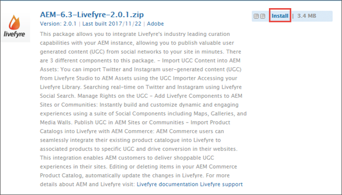

# Getting Started

## Getting Started {#topic_87456823DEBF4167ADE6BDCE74F4230D}To get started with Livefyre and AEM 6.2/6.3:

1. [Install Livefyre Package for AEM](c_livefyre-aem.md#task_B2552594101E448E9123C04AD579630D)
1. [Configure AEM to Use Livefyre](c_livefyre-aem.md#task_1E4D0790C2B840149245D03A84F0B5D1)
1. [Customize Single Sign-on Integration](c_livefyre-aem.md#task_E918244666C24EE0932137373B0731EA)

>## Install Livefyre Package for AEM {#task_B2552594101E448E9123C04AD579630D}Steps on how to install the latest Livefyre package that integrates Livefyre with Adobe Experience Manager.To Install and use the latest Livefyre AEM package, you need Adobe Experience Manager 6.2 or 6.3. The latest version of AEM is recommended to make full use of features.

>[!NOTE]
>
>AEM 6.3 comes with Livefyre feature package 1.1.19 pre-installed. This package only includes Livefyre integration with AEM Sites and must be uninstalled before installing an updated package. With the latest package, you can experience the full integration of Livefyre with AEM, including Sites, Assets, and Commerce. If you are running AEM 6.2, no pre-installed Livefyre package exists and you can skip to step 4.

>1. From the AEM homepage, click on the ** `Tools` ** icon on the left-hand rail.
>1. Navigate to ** `Deployment` ** > ** `Packages` **.
>1. In the Package Manager, scroll until you see the pre-installed Livefyre feature package. Click on the package title, then click ** `More` ** > ** `Uninstall` **.
>   >
>1. Return to the AEM homepage, click on ** `Tools` **, then navigate to ** `Deployment` ** > ** `Package Share` **.

>1. In the keyword search, search for "Livefyre", then select the Livefyre feature pack corresponding to your AEM version.
>   >
>1. On the feature pack information page, click ** `Download` **, then read the Package License Agreement and click ** `Accept` **.
>1. Revert back to the Package Manager, locate the newly downloaded package, and click ** `Install` **.
>   >

>       [Configure AEM to Use Livefyre](c_livefyre-aem.md#task_1E4D0790C2B840149245D03A84F0B5D1)For more information on packages, see [How to Work With Packages](https://helpx.adobe.com/experience-manager/6-3/sites/administering/using/package-manager.html). 
>## Configure AEM to use Livefyre {#task_1E4D0790C2B840149245D03A84F0B5D1}Configure AEM to use your organization's Livefyre license credentials, allowing communication between Livefyre and AEM.
>1. From the AEM homepage, click on the ** `Tools` ** icon in the left-hand rail, then navigate to ** `Deployment` ** > ** `Cloud Services` **.
>1. Scroll until you see Livefyre, then click on ** `Configure now` ** (or ** `Show Configurations` **, then click the ** `+` ** sign).
>1. Enter a title then click ** `Create` **.
>1. Enter your organization's Livefyre credentials, then click ** `OK` **.
>    
>   To access this information, open Livefyre studio and navigate to ** `Settings` ** > ** `Integration Settings` ** > ** `Credentials` **. 
>   Your AEM instance is now configured to use Livefyre and you can use the integration features.

>   >[!NOTE]
>   >
>   >If your AEM Publish and AEM Author instances do not share the same cryptographic key, you may need to repeat this process on any other instances. Network Key and Site Key are encrypted and therefore cannot be unencrypted by other instances. For more information, see[Replicate the Crypto Key](https://helpx.adobe.com/experience-manager/6-3/communities/using/deploy-communities.html#ReplicatetheCryptoKey). 

>
>## Customize Single Sign-on Integration {#task_E918244666C24EE0932137373B0731EA}The Livefyre for AEM package includes an out-of-the-box integration between AEM Communities profiles and Livefyre's SSO service.When users log into your AEM site, they are also logged into Livefyre social components. When a logged-out user attempts to use a Livefyre component feature that requires authentication (like uploading a photo), the Livefyre component initiates user authentication.
The default authentication integration may not be perfect for every site. To best match the authentication flow in your site templates, you can override the default Livefyre Authentication Delegate to meet your needs. Use these steps:

>1. Using CRXDE Lite, copy `/libs/social/integrations/livefyre/components/authorizablecomponent/authclientlib` to `/apps/social/integrations/livefyre/components/authorizablecomponent/authclientlib`.
>1. Edit and save `/apps/social/integrations/livefyre/components/authorizablecomponent/authclientlib/auth.js` to implement a Livefyre Auth Delegate that meets your needs.
>   For more information on customizing an Auth Delegate, see [Identity Integration](https://answers.livefyre.com/developers/identity-integration/). 
>   For more information on AEM Clientlibs, see [Using Client-Side Libraries](https://helpx.adobe.com/experience-manager/6-3/sites/developing/using/clientlibs.html). 
>
