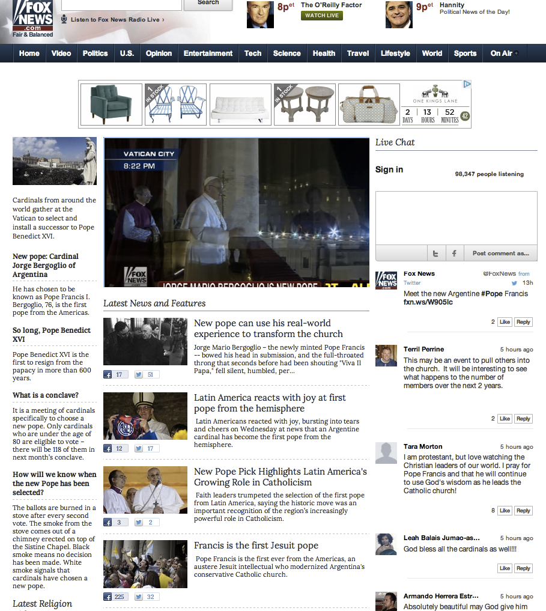

# Chat{#chat}

Enable real-time chat on your sites.

Chat allows audiences to engage in real-time conversation around live events, announcements or shows. Content appears as a continuous stream of unthreaded chat to facilitate rapid engagement and invigorate activity on the page.

Fox News used Chat to capture audience opinion and reflection around the election of Pope Bergoglio. Knowing that there would be a surge of relevant and active participation, Fox News launched a Chat within minutes of the announcement to create an immediate conversation.

