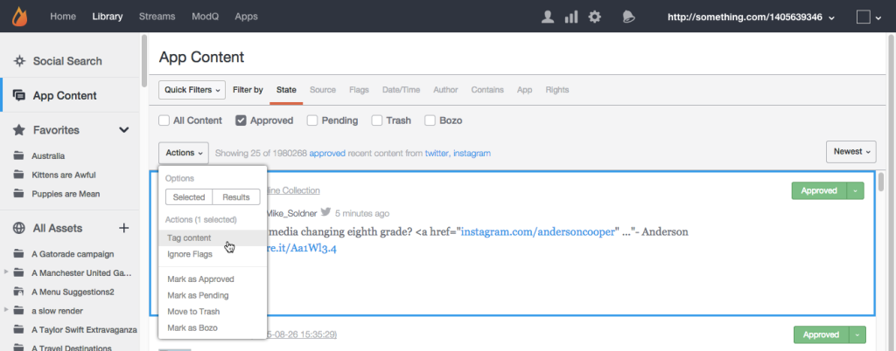
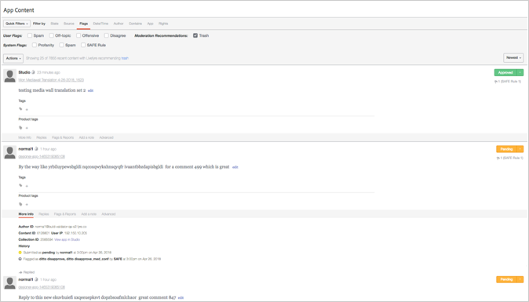
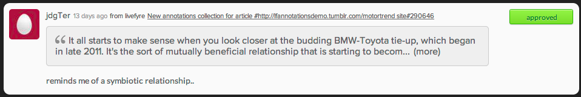

# Moderate Content using App Content{#moderate-content-using-app-content}

The App Content tab in your Library allows you to moderate content published across your Apps.

## Moderate Content {#section_md5_sqm_zz}

Use the App Content panel to moderate listed content, by changing its status, changing the status of its author, or adding a note. To moderate content, mouse over listed content to change available markers, or use the **[!UICONTROL pulldown]** menu to change status for individual or multiple selected content.

In App content you can:

* **[!UICONTROL Tag Content]**. Select **[!UICONTROL Tag Content]** to add tags to individual or multiple pieces of content simultaneously.

* **[!UICONTROL Ignore Flags]**. Select **[!UICONTROL Ignore Flags]** to exclude selected content from the flagged search filter results. Selecting **[!UICONTROL Ignore Flags]** for an item does not change its status; it simply removes it from the search results for this search filter going forward, for all Studio users.

* **[!UICONTROL Change Content Status]**. Click a piece of content, then use the **[!UICONTROL Actions]** menu to change its status. (Use the Command or Control key to select multiple items, then use the menu to change the status for multiple pieces of content simultaneously.)

  Options vary according to the current state of the listed content.

  |  Current State  | May be Changed to  |
  |---|---|
  |  Approved  | Pending, Trash, Bozo  |
  |  Bozo  | Approved, Pending, Trash  |
  |  Trash  | Approved, Pending, Bozo, Delete  |
  |  Pending  | Approved, Trash, Bozo  |

* **[!UICONTROL Save as Assets]**. Select **[!UICONTROL Save as Assets]** to open the Advanced Options dialog, from which you may save the selected item(s) to your Asset Library, Publish it to an App, or request reuse rights from its author.

* Moderate based on recommendations. Use the **[!UICONTROL Moderation Recommendation Indicator]** in App Content to filter content that the moderation recommendation identifies as likely to be trashed.

  In App Content, moderation recommendations look like this:  

## Moderate Sidenotes Content {#section_i2s_nqm_zz}

Working with Sidenotes in the Content panel differs from working with other types of content in several ways:

* The More Info, Replies, Flags & Reports and Add a Note tabs are not available.
* You cannot Tag Sidenotes content, or mark it as Featured.

It also differs in that it displays not only the content to be moderated; it also displays the text selected when the Sidenote was added, allowing you to evaluate the content in context.

Click on the text box to expand it to include the entirety of the quote selected by your user.

Sidenotes content moderation allows both bulk changes, and individual status changes, as described above.

## Moderate Livefyre Users {#section_grw_mqm_zz}

Mouse over the username for a Livefyre user to open a pulldown menu, allowing you to **[!UICONTROL Ban the User]**, get **[!UICONTROL More Info]**, or view a list of their **[!UICONTROL Comments]**. Clicking on this menu will open the User’s info card in Studio’s **[!UICONTROL Users]** page.

For more information on how to moderate users in the **[!UICONTROL Users]** page, see [Moderate Users ModQ](/help/using/c-features-livefyre/c-about-moderation/t-moderate-users-modq.md#t_moderate_users_modq).
