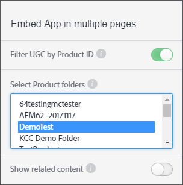

# Filter UGC by product ID {#filter-ugc-product-id}

Filtering UGC by product ID allows you to embed the exact same app on multiple pages while showing different product-specific UGC for each page.

To filter UGC by product ID, follow these steps:

1. In Livefyre Studio, navigate to the **[!UICONTROL Apps]** tab.

1. Select the App you want to modify.

1. Select the Designer tab in the left-hand rail.

1. Enable **[!UICONTROL Filter UGC by Product ID]**.



1. Select the top-level product folders which contain the product or products you want to filter UGC by.
  Use CTRL/Command + click to select multiple folders.

1. Disable **[!UICONTROL Show related content]**.
  When enabled, content that is filtered using the `data-lf-attr-product` attribute will display first, followed by all other content in the app.

1. Click **[!UICONTROL Publish]**.

1. Insert the product IDs you want to filter by into the resultant code.

>[!NOTE]
>
>To locate product IDs, navigate to **[!UICONTROL Settings > Products]**. Locate the desired product and select it and the ID displays.

For example, the following code is generated for a Media Wall App:

```
<script type="text/javascript" src="https://cdn.livefyre.com/
Livefyre.js"></script><div class="lf-app-embed" data-lfapp="
59dc41fa-85a5-49ed-8d60-d74616b3ccd1/tagged/published" datalf-
env="prod" data-lf-read-only="" data-lf-attr-product="<product
 1>,<product 2>"></div><script>Livefyre.require(["app-embed#1.0.11"],
 function (appEmbed) {appEmbed.loadAll().done(function(embed)
 {embed = embed[0];if (embed.el.onload && embed.getConfig)
 {embed.el.onload(embed.getConfig());}});});</script>
```

To tag a product, replace `<product 1>` in the `data-lf-attr-product` attribute with the desired product
ID. You can tag one product or more by adding additional comma-separated product IDs. Products must be
contained within the top-level product folder or folders selected in Step 5.
| Filter UGC by product ID | 2
The modified code segment would appear as:

```
<script type="text/javascript" src="https://cdn.livefyre.com/
Livefyre.js"></script><div class="lf-app-embed" data-lfapp="
59dc41fa-85a5-49ed-8d60-d74616b3ccd1/tagged/published"
 data-lf-env="prod" data-lf-read-only="" data-lf-attrproduct="
109,47"></div><script>Livefyre.require(["app-embed#1.0.11"],
 function (appEmbed) {appEmbed.loadAll().done(function(embed)
 {embed = embed[0];if (embed.el.onload && embed.getConfig)
 {embed.el.onload(embed.getConfig());}});});</script>
```

The app will now only display the tagged product IDs.