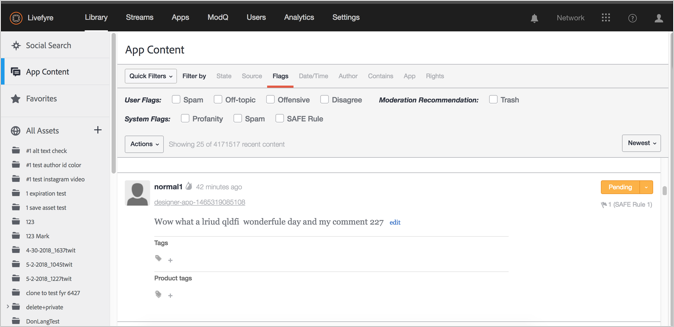
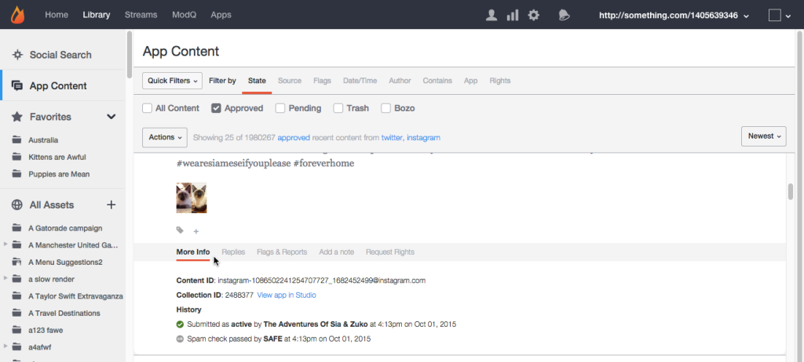
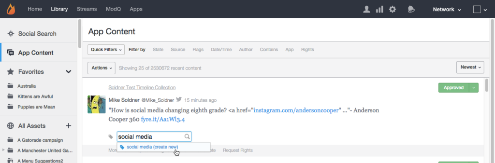

# App Content Tab{#app-content-tab}

Managing content across your Livefyre network.

On this page:

*  
*  
*  
*  
*  
*  
*  
*  
*  
* 

The App Content tab in your Library allows you to search and moderate content published across your Apps. The **[!UICONTROL App Content]** tab enables several search filters with wildcard search, to allow you to more quickly and easily define your search parameters.

Use the App Content tab to:

* Search for Content
* View Content History
* Moderate Content
* Add a Tag
* Feature Content
* Associate Content with Products from the Product Catalog

For more information on how to moderate content using the App Content tab, see .

## Wildcard Search {#section_jvr_ntm_zz}

Livefyre search fields support wildcards, which allow you to add an asterisk ( &#42; ) to words (or word fragments) to catch partial matches.

For example:

* ball returns only ball
* ball&#42; returns ball and balloon
* &#42;ball returns ball and football
* &#42;ball&#42; returns ball and uniball and snowballed

## Search for Content {#section_fw1_mtm_zz}

The App Content panel allows you to narrow your search using several different content filtering options.

Use the **[!UICONTROL Quick Filters]** pulldown to narrow returned content to **[!UICONTROL All Content]**, **[!UICONTROL All Sidenotes]**, **[!UICONTROL Approved]**, **[!UICONTROL Approved & Flagged]**, **[!UICONTROL Pending]**, or **[!UICONTROL Rights Requests]** status. Then select a **[!UICONTROL Filter by]** option, and use the checkboxes or input fields available to narrow your search.

Use the pulldown menu to sort the content in the list by **[!UICONTROL Newest]**, **[!UICONTROL Oldest]**, **[!UICONTROL Recently updated]**, **[!UICONTROL Most flags]** or **[!UICONTROL Most liked]**.

## Filter by options {#section_aqn_xqm_zz}

Use the **[!UICONTROL Filter by]** bar to filter by the following options:

* **State** Allows you to filter by the content’s current moderation state:** [!UICONTROL All Content]**, **[!UICONTROL Approved]**, **[!UICONTROL Pending]**, or **[!UICONTROL Bozo]**.

* **Source** Allows you to filter by the content’s source. Select **[!UICONTROL Livefyre]** to list user generated content posted directly into the stream. Select **[!UICONTROL Facebook]**, **[!UICONTROL Twitter]**, or **[!UICONTROL RSS]** to include content pulled into your Apps from those sources.

* **Flags** Selecting Flags allows you to filter by **[!UICONTROL User Flags]** (Spam, Off-topic, Offensive, or Disagree), **[!UICONTROL System Flags]** applied by SAFE (Profanity, Spam, or Magically Moderated), or **[!UICONTROL Moderation Recommendations]**. 

* **Date/Time** Allows you to fiter by when the content was originally **[!UICONTROL Created]** (or pulled into the App through SocialSync or a Stream), or last **[!UICONTROL Modified]** (edited, flagged or the state changed).

* **Author** Allows you to filter by the author’s **[!UICONTROL IP]** address, **[!UICONTROL Display Name]** (found on the Users panel or from above the content posted by the author), or **[!UICONTROL User ID]**(found on the Users panel).

* **Contains** Allows you to filter the most recent 90 days of content by **[!UICONTROL Keyword]** or **[!UICONTROL Content Tag]**. Select the **[!UICONTROL Media]** checkbox to return only content containing Media. (To search for all content, scroll down through all content in the list, then click **[!UICONTROL Search full data]**.)

  **Note:** Multiple keyword and content tag search is not supported. If multiple keywords or tags are entered, the last word will be used for the search.

  When searching by Content Tag, suggested tags will be auto-populated as you type into the search field. Search results will return all content that has ever been assigned the tag. (Use this field to search for Featured content, or click the **[!UICONTROL Featured]** label on any featured content in Studio.)

  **Note:** Use a minus (-) sign before a tag name to search for content that does not include that tag. For example: Search for ‘-Miley’ to search for all content that does not include the ‘Miley’ tag.

* **App** Allows you to filter by **[!UICONTROL Collection ID]**, **[!UICONTROL App Tag]**, or **Parent ID**. Filtering by Parent ID returns all content that is a reply to the input Content ID. (Filter by multiple tags by entering tags separated by a comma.)

* **Rights** Allows you to filter by Rights Requests status:** [!UICONTROL Requested]**, **[!UICONTROL Granted]**, **[!UICONTROL Replied]**, or **[!UICONTROL Expired]**.

## Bozo Content {#section_afl_vqm_zz}

In Apps, **[!UICONTROL Bozo]** content is displayed only to the author of the content. This allows the user to believe their content has been approved, while hiding it from all other users and moderators.

>[!NOTE]
>
>Social content originating with SocialSync or Streams **[!UICONTROL cannot]** be set to Bozo.

You can Bozo content for the following reasons:

* Content identified as Spam by SAFE is automatically set to the Bozo state.
* All content from Banned Users is automatically set to Bozo.
* Content may be marked Bozo from Studio.
* Moderators may Bozo content directly in the stream.

## View Content History {#section_ayz_tqm_zz}

The content panel allows you to review the history of all content listed, including premoderation, spam filtering, post date, and any user flags or notes assigned to the item.

Use the tabs across the bottom of the content panel to view its history.

* **[!UICONTROL More Info:]** lists all activity on this content, including submission, editing, spam check, state change, and notes. The Livefyre Content ID and the user’s IP address is also displayed in this section.
* **[!UICONTROL Replies:]** lists a maximum of 6 replies. Click **[!UICONTROL Show all replies]** to display all replies to the post.

* **[!UICONTROL Flags & Reports:]** lists all user flags, with the avatar of the user who flagged the content, and any Reports (notes that were added by the user when flagging the content).
* **[!UICONTROL Add a note:]** allows you to add a note, visible to other Admins or Moderators.
* **[!UICONTROL Request Rights:]** opens the **[!UICONTROL New Rights Request]** dialog, from which a Rights Request may be issued.

* **[!UICONTROL Save as Asset:]**opens the **[!UICONTROL Advanced Options]** dialog, which allows you to save the selected item to your Asset Library, Publish it to an App, or request reuse rights from its author.

## Add a Tag to Content {#section_xb4_mxr_rdb}

Tagging content allows you to categorize and organize content for easy retrieval and style customization, or mark content as featured.

To add Tags, simply click the plus ( **[!UICONTROL +]**) icon under content. Enter a new tag, or select from a list of existing tags.

## Searching for Images in All Assets {#section_zxf_hsf_wcb}

Once you have added the content to the library, you can search content by smart tags.

In the Library, under All Assets, you can search existing images by clicking on **[!UICONTROL Show Filters]** and then:

* Entering text to search in the search field
* Sorting by relevance
* Entering text in the **[!UICONTROL Tags]** field to search by Smart Tags. The Smart Tags ranking algorithm filters content using a smart tag confidence score, how new the content is, and how many stars a user gave the content.

## Featured Content {#section_emb_kqm_zz}

Select the default **[!UICONTROL Featured]** tag to mark the content as featured, and highlight it as important to your users. Once tagged, use custom styling options to customize Featured Content in your Apps.

## To Feature or Unfeature Content {#section_ojx_3qm_zz}

* From Studio, click the **[!UICONTROL +]** sign beside a piece of content, select the **[!UICONTROL Featured]** tag in the dropdown list, and click **[!UICONTROL Enter]** to Feature content. The tag will be saved and displayed beside the piece of content.

* To un-feature, click the **[!UICONTROL x]** on the **[!UICONTROL Featured]** tag displayed on the piece of content.

* From within a Comments, Live Blog or Reviews App, hover over the content you wish to feature, and click **[!UICONTROL Feature]**. To unfeature, simply hover over the content, and click **[!UICONTROL Unfeature]**.

>[!NOTE]
>
>Due to space constraints, Chat content may only be featured or unfeatured using Studio, and may not be featured from within the App itself.

## Editing Featured Content {#section_pyw_hqm_zz}

Most regular actions on content can be taken on Featured content, with the exception of the following:

* Featured content cannot be flagged.
* Users cannot edit their content after it has been Featured, although they can still delete it if they wish. Moderators can edit Featured content.

