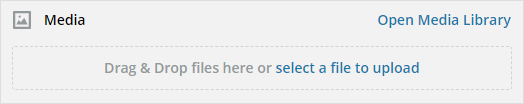

# Use Adobe Experience Manager Livefyre with Hootsuite{#use-adobe-experience-manager-livefyre-with-hootsuite}

Learn how to use Experience Manager Livefyre with Hootsuite, allowing you to curate, manage, and share user-generated-content directly from the Hootsuite dashboard.

## Use Adobe Experience Manager Livefyre with Hootsuite {#topic_FB6E613DBCF74F39ABD5045C501EA326}

Learn how to use Experience Manager Livefyre with Hootsuite, allowing you to curate, manage, and share user-generated-content directly from the Hootsuite dashboard.

## Getting Started {#task_22699BD901C24384AB2DC02D926D8F4A}

Task Context 

1. Install [Adobe Experience Manager Livefyre for Hootsuite](http://apps.hootsuite.com/0/adobe-livefyre) from the Hootsuite App Directory.
1. From your Hootsuite dashboard, click **Login with Adobe**.

   

1. Login to Experience Manager Livefyre using your Livefyre credentials.
1. Click **Authorize** to give Hootsuite permission to access your libraries.

   

   Once you grant permission, you will be taken back to the Hootsuite dashboard where you can search for assets in your Experience Manager Livefyre libraries. 

## Search for Assets {#task_0B011B0C539E400BB72A6DF69FBF66C0}

Task Context 

1. Click the search icon in the menu bar to search for assets in your Experience Manager Livefyre libraries.

   

1. Click **Select** and a popup will be displayed with all of your libraries.
1. Click a library's folder and then click **Select Folder** to select the library that will be displayed in your Hootsuite stream.

   

## Filtering Options {#concept_5D062A9CD61A4B2E90784E5AA31CB16D}

You can filter your search results by using the Display Assets From, Rights, Keywords, and Tags sections.

The filtering options include:

<table id="table_0E8FFD7602BF4D00A3923983C0D8B5ED"> 
 <thead> 
  <tr> 
   <th colname="col1" class="entry"> Section </th> 
   <th colname="col2" class="entry"> Description </th> 
  </tr>
 </thead>
 <tbody> 
  <tr> 
   <td colname="col1"> <b>Display Assets From</b> </td> 
   <td colname="col2"> 
Select to view assets from All Sources or from one individual source. For example: Instagram, Twitter, Facebook, etc. 
 </td> 
  </tr> 
  <tr> 
   <td colname="col1"> <b>Rights</b> </td> 
   <td colname="col2"> 
Select to view only assets that have a specific rights setting. 
 </td> 
  </tr> 
  <tr> 
   <td colname="col1"> <b>Keywords</b> </td> 
   <td colname="col2"> 
Select to filter results by Keywords or Tags. Filtering by keywords will search the text content of a post as well as the author display name and author username. 
 </td> 
  </tr> 
  <tr> 
   <td colname="col1"> <b>Tags</b> </td> 
   <td colname="col2"> 
 Select to filter results by Keywords or Tags. Filtering by keywords will search the text content of a post as well as the author display name and author username. 
 </td> 
  </tr> 
 </tbody> 
</table>

Once you have selected your search parameters, your assets will be displayed in-stream when you search:

**Stream Menu Options**

Clicking the user's name or icon will display the user on the respective network. Clicking the time will display the original article. When your mouse is over the item, more options will appear. Clicking the Share 

icon will add the current asset to the network compose box, allowing you to share it with your networks via Hootsuite.

>[!NOTE]
>
>The share button will only appear when you are filtering for assets with granted rights.

Click the Assign   icon to assign the current item to one of your Hootsuite team members. If an item has already been assigned, the Resolve  

icon will appear. Click it to resolve the current assignment.

**Other App Menus**

Clicking the Settings  

icon will allow you to disconnect the current Experience Manager Livefyre account, and connect with another one.

Clicking the Menu  

icon will display links for this document, support, and Synaptive's website. 

## Experience Manager Livefyre App Plugin {#task_33C8CEF4F5E44830B970BB3A7AAA2AA6}

In addition to being able to display your asset libraries in a Hootsuite stream, you can also save items from Instagram, Twitter, Facebook and YouTube streams to your Experience Manager Livefyre libraries. 

1. Click the Menu  

   icon found at the bottom of each item.

   

1. Select **Send to AEM Livefyre**.
1. Select one or more libraries to save the asset to.

   

1. Click **Save to library**, and the item will be saved to the libraries you've selected.

## Experience Manager Livefyre Media Library Component {#task_9CA2D5D49F8E463F9EF475BC09C8ACC9}

You can access your assets via Hootsuite Composer's Media Components. 

1. From the Composer, click the **Open Media Library** link in the **Media** section.

   

1. Select Adobe Experience Manager Livefyre from the dropdown menu, and your files will be displayed.

   

1. To add an asset to the current post you are writing, click on it. To search for a specific asset, enter the search terms in the **Search Media** box, and results will be displayed.
