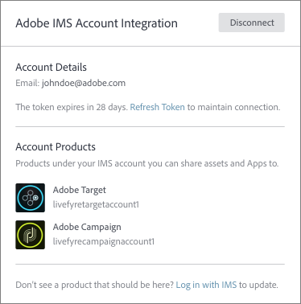
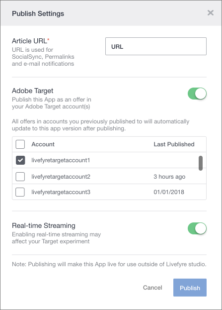

# Use Adobe Experience Manager Livefyre with Adobe Target {#livefyre-target}

Livefyre integration with Adobe Target allows you to share Livefyre Apps directly to your Target Offers Library.

## Connect a Livefyre Instance with Target {#connect-livefyre-target}

Connect a Livefyre instance with Adobe Target by linking your Adobe IMS account in user settings.

1. In Livefyre Studio, click the **[!UICONTROL Users]** tab.

1. Select the user account which you want to connect to Target via IMS Account Integration.

1. Click **[!UICONTROL Connect]**.

1. Enter your IMS credentials.

The product instances your Adobe IMS account has access to display in the Adobe IMS Integration window.

Your Livefyre instance is now connected to Adobe Target.

## Share a Livefyre App with Adobe Target {#share-livefyre-target}

Share an App created in Livefyre Studio directly with Adobe Target.

1. In Livefyre Studio, click the **[!UICONTROL Apps]** tab.

1. Select the App you want to share to Adobe Target.

1. Click **[!UICONTROL Publish]**.

1. In the Publish Settings, click the Adobe Target switch.

A list of Target Instances appears.

1. Select the Target instance in which you want to share the App.

1. Click  **[!UICONTROL Publish]**.

The Livefyre App is now available to use in your Target Offers Library. For more information on publishing Apps, see [Publish Content](/help/using/c-library/t-publish-content.md) and [Offers](https://marketing.adobe.com/resources/help/en_US/target/target/c_manage_content.html) in the Target documentation.