# Localize Strings{#localize-strings}

Customizing the strings of the Livefyre Apps.

The text strings for most HTML elements in any Livefyre App may be customized. This provides the flexibility to change the text of rendered HTML elements, such as the “Post As” button, the “Comment Count” text, or the “Sign In” button, to any valid UTF-8 string. Use this feature to add personality to your implementation of the stream, or to localize the language in the app for your user base.

* Comments, Chat, and Live Blog

  * [Implementation](#c-localize-strings/section_im4_224_xz)
  * [Account Access](#c-localize-strings/section_cm3_d24_xz)
  * [Stream Info](#c-localize-strings/section_wx1_c24_xz) 
  * [Stream Sorting](#c-localize-strings/section_ih2_124_xz)
  * [Content Info](#c-localize-strings/section_llv_yd4_xz)
  * [Featured Content](#c-localize-strings/section_gmw_vd4_xz)
  * [Text Editor](#c-localize-strings/section_ky5_td4_xz)
  * [Response Options](#c-localize-strings/section_zvt_qd4_xz)
  * [Comment Notifier](#c-localize-strings/section_qqt_pd4_xz)
  * [Error Messages](#c-localize-strings/section_omz_jxn_xz)

* [Time and Date Format](#c-localize-strings/section_yz4_g5n_xz)
* [Media Wall](#c-localize-strings/section_vwt_d5n_xz)
* [Map](#c-localize-strings/section_fxv_c5n_xz)
* [Mosaic](#c-localize-strings/section_e2s_b5n_xz)
* [Carousel](#c-localize-strings/section_l2z_hkn_xz)
* [Feature Card](#c-localize-strings/section_mw2_hkn_xz)
* [Poll](#c-localize-strings/section_pdg_fwh_xz)
* [Livefyre Identity](#c-localize-strings/section_zc3_xvh_xz)
* More:
  * [Review Text Strings](../../c-settings-other/c-translation-sets/c-review-text-strings.md#c_review_text_strings)
  * [Sidenotes](../../c-settings-other/c-translation-sets/c-sidenotes-text-strings.md#c_sidenotes_text_strings)

## Implementation {#section_im4_224_xz}

To implement this feature, pass in a 1-1 object mapping of the strings you wish to override to the JavaScript configuration object. If you don’t provide a field, then the default text will be used.

Example:

```
var customStrings = {     
   postAsButton: "New Post As Text",     
   postEditButton: "New Post Edit Text"  
};   
   convConfig["strings"] = customStrings; fyre.conv.load(     
   networkConfig,     
   [convConfig],     
   function(){}  
);
```

This page lists all text strings which may be customized for the Livefyre Core Apps.

## Account Access {#section_cm3_d24_xz}

Strings available for the Authentication process, and from the authenticated user menus.

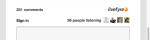 

|  Element  | Key  | Default Text  |
|---|---|---|
|  | displayName  | %s  |
|  | editProfile  | Edit profile  |
|  | notificationSettings  | Notification settings  |
|  | siteAdmin  | Admin Console (links to Studio)  |
|  | signOut  | Sign out  |

## Stream Info {#section_wx1_c24_xz}

Strings available for content stream information and display. Lists the number of people listening, the number of posts to the App, and allows users to sign in, or access their account information.

|  Key  | Default Text  | Stream data  |
|---|---|---|
|  | commentCountLabelZero  | %s comment  |
|  | commentCountLabel  | %s comment  |
|  | commentCountLabelPlural  | %s comments  |
|  | listenerCount  | person listening  |
|  | listenerCountPlural  | people listening  |
|  | liveblogPostCountLabelZero  | post  |
|  | liveblogPostCountLabel  | post  |
|  | liveblogPostCountLabelPlural  | posts  |
|  **Thread options** | | |
|  | threadBreakoutButton  | Show entire Thread  |
|  | toggleCollapse  | Toggle Collapse  |
|  **High velocity / queued comments** | | |
|  | refresh  | Refresh  |
|  | newComment  | New Comment  |
|  | newComments  | New Comments  |
|  | newReply  | new reply  |
|  | newReplies  | new replies  |

## Stream Sorting {#section_ih2_124_xz}

Allows uses to sort returned content by age or popularity.

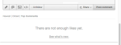 

|  Key  | Default Text  | Header options  |
|---|---|---|
|  | sortNewest  | Newest  |
|  | sortOldest  | Oldest  |
|  | sortTopComments  | Top Comments  |
|  | sortHotThreads  | Hot Threads  |
|  | sortSeparator  | |  |
|  | streamSorting  | Loading  |
|  | topCommentsContentNotFoundMsg  | There are not enough likes yet.  |
|  | hotThreadsContentNotFoundMsg  | There are not enough threads yet.  |
|  | streamRefreshMsg  | See what’s new.  |
|  **Footer options** | | |
|  | archiveHeaderTitle  | From the Archive  |
|  | archiveShowMore  | Show More  |
|  | showMore  | Show More Comments  |
|  | showMoreLiveblog  | Show More Posts  |

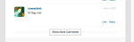

## Content Info {#section_llv_yd4_xz}

Lists post information: user name, any applied user tags, and post time.

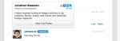  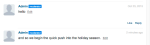 

|  Key  | Default Text  | Author  |
|---|---|---|
|  | moderator  | moderator  |
|  | hovercardViewProfile  | View Full Profile  |
|  **Post info** | | |
|  | timeJustNow  | just now  |
|  | timeMinutesAgo  | minute ago  |
|  | timeMinutesAgoPlural  | minutes ago  |
|  | timeHoursAgo  | hour ago  |
|  | timeHoursAgoPlural  | hours ago  |
|  | timeDaysAgo  | day ago  |
|  | timeDaysAgoPlural  | days ago  |
|  | likesPlural  | Likes  |
|  | likesSingular  | Like  |
|  | moderatorEditTimestamp  | Edited by a Moderator  |
|  | commentTombstone  | This comment has been deleted  |
|  | permalinkNotFoundMsg  | This comment is no longer visible.  |
|  | quickProfileTooltip  | Quick Profile  |

## Featured Content {#section_gmw_vd4_xz}

If enabled, featured content is listed at the top of the stream.

|  | Key  | Default Text  |
|---|---|---|
|  **Featured labels** | | |
|   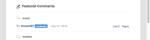 | featuredCommentsTag  | Featured  |
|  | featuredCommentsTitlePlural  | Featured Comments  |

## Text Editor {#section_ky5_td4_xz}

By default, available at the top of the page for all users.

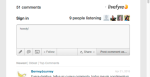

|  | Key  | Default Text  |
|---|---|---|
|  **Editor buttons** | |
| follow  | + Follow  |
|  | unfollow  | - Unfollow  |
|  | liveblogFollow  | Follow Live Blog  |
|  | liveblogUnfollow  | Unfollow Live Blog  |
|  | postButton(Available for logged in users.)  | Post comment  |
|  | postAsButton(Available for unauthenticated users.)  | Post comment as…  |
|  | postEditButton  | Edit comment  |
|  | postEditAsButton  | Edit comment as…  |
|  | postEditCancelButton  | Cancel  |
|  | editorDisabled  | This conversation is currently closed to new comments.  |
|  **Chat options** | | |
|  | livechatPostButtonLabel  | Post  |
|  | livechatPostEditButton  | Edit  |
|  | livechatWindowsInstruction  | Press control+enter to post  |
|  | livechatOtherInstruction  | Press command+enter to post  |

## Response Options {#section_zvt_qd4_xz}

Unless otherwise noted, available to all logged in users. Mouse over a content panel to access.

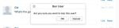

|  Key  | Default Text  | |
|---|---|---|
|  **User Response Options** | Available for end users.  | |
| flagButton  | Flag  |
|  | flagCommentTooltip  | Flag  |
|  | editButton(Available only for authors and moderators, if enabled.)  | Edit  |
|  | deleteButton(Available only for authors and moderators, if enabled.)  | Delete  |
|  | deleteCommentTooltip  | Delete  |
|  | shareButton  | Share  |
|  | shareCommentTooltip  | Share  |
|  | likeButton  | Like  |
|  | unlikeButton  | Unlike  |
|  | replyButton  | Reply  |
|  | replyButtonSingular(Available for Chat and Live Blog.)  | Reply  |
|  | replyButtonPlural(Available for Chat and Live Blog.)  | Replies  |

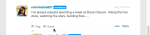

|  Key  | Default Text  | |
|---|---|---|
|  **Flag Modal** | | |
| flagTitle  | Flag %s’s comment  |
|  | flagSubtitle  | Flag as  |
|  | flagDefaultSelectOption  | Select  |
|  | flagSpam  | Spam  |
|  | flagSpamButton  | Spam  |
|  | flagSpamCommentTooltip  | Spam  |
|  | flagOffensive  | Offensive  |
|  | flagOffensiveButton  | Offensive  |
|  | flagOffensiveCommentTooltip  | Offensive  |
|  | flagDisagree  | Disagree  |
|  | flagDisagreeButton  | Disagree  |
|  | flagDisagreeCommentTooltip  | Disagree  |
|  | flagOffTopic  | Off Topic  |
|  | flagOfftopicButton  | Off Topic  |
|  | flagOfftopicCommentTooltip  | Off Topic  |
|  | flagEmail  | Email  |
|  | flagEmailPlaceholder  | you@example.com  |
|  | flagNotes  | Notes  |
|  | flagNotesPlaceholder  | Start typing here…  |
|  | flagConfirmButton  | OK  |
|  | flagCancelButton  | Cancel  |
|  | flagConfirmationMessage  | Flag %s’s comment as %s?  |
|  | flagSuccessMsg  | Comment has been flagged.  |

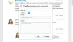

|  Key  | Default Text  | |
|---|---|---|
|  **Share Modal** | | |
| shareTitle  | Share Comment  |
|  | sharePlaceholderText  | What do you think?  |
|  | shareLabel  | Share on:  |
|  | shareTextTwitter  | blank  |
|  | shareTextFacebook  | blank  |
|  | shareTextLinkedin  | blank  |
|  | shareButtonText  | Share  |
|  | sharePermalink  | Permalink  |
|  | loadingPermalink  | Loading short url…  |
|  | shareText  | I just posted a comment. Check it out!  |

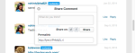

|  Key  | Default Text  | |
|---|---|---|
|  **Reply Modal** | | |
| postReplyAsButton  | Post comment as…  |
|  | postReplyButton(Available for logged in users.)  | Post comment  |
|  | backToHotThreads  | Back to Hot Threads  |

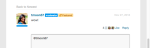

|  Key  | Default Text  | |
|---|---|---|
|  **Twitter @mention modal** | | |
| mentionTitle  | Share Mention  |
|  | mentionSubtitleTwitter  | Share Tweet to:  |
|  | mentionDefaultText  | I mentioned you in a Livefyre comment!  |
|  | mentionConfirmButton  | OK  |
|  | mentionCancelButton  | Cancel  |
|  | mentionErrorGeneral  | Oops! Something went wrong! Livefyre has been alerted.  |
|  | mentionErrorNoneSelected  | You must have at least one mention enabled.  |
|  | mentionMenuTitle  | To see and mention your friends  |
|  | mentionTwitterConnect  | Connect to Twitter  |
|  | mentionTwitterFetching  | Fetching Friends…  |
|  | mentionSuccessMsg  | Mentions have been successfully sent.  |

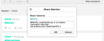

|  Key  | Default Text  | |
|---|---|---|
|  **Edit Modal** | Available to Studio Admins, User Managers or Moderators  | |
| @(@mention.)  | |
|  | &lt;/&gt;(Opens the custom html window.)  | |
|  | customHtmlDialogTitle(Appears as the header for the modal.)  | Add Custom HTML  |

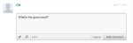

|  Key  | Default Text  | |
|---|---|---|
|  **Moderator Response Options** | Available to Studio Admins, User Managers or Moderators.  | |
| pendingComment  | pending  |
|  | banUserButton  | Ban user  |
|  | banUserTooltip  | Ban User  |
|  | bozoButton  | Bozo  |
|  | bozoCommentTooltip  | Bozo  |
|  | featureButton  | Feature  |
|  | featureCommentTooltip  | Feature  |
|  | unfeatureButton  | Unfeature  |
|  | featuredCommentTooltip  | Unfeature  |
|  | | |

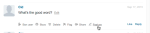

|  Key  | Default Text  | |
|---|---|---|
|  **Ban User modal** | Available to Studio Admins, User Managers or Moderators.  | |
| banTitle  | Ban User  |
|  | banConfirmation  | Are you sure you want to ban this user?  |
|  | banConfirmButton  | OK  |
|  | banCancelButton  | Cancel  |

## Comment Notifier {#section_qqt_pd4_xz}

If enabled, available at the bottom of the page for all Livefyre conversation Apps.

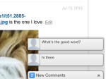

|  | Key  | Default Text  |
|---|---|---|
|  **Notifier labels** | | |
| commentNotifier  | New Comment  |
|  | commentNotifierPlural  | New Comments  |
|  | liveblogNotifier  | New Post  |
|  | liveblogNotifierPlural  | New Posts  |

## Error Messages {#section_omz_jxn_xz}

Strings available for customizable error messages.

|  Key  | Default Text  |
|---|---|
|  errorAuthError  | You’re not authorized to post a comment on this conversation  |
|  errorCommentsNotAllowed  | Comments are not allowed on this conversation  |
|  errorDefault  | An error has occurred. Please try again.  |
|  errorDuplicate  | As much as you liked your comment, you’re not allowed to post it twice.  |
|  errorEditDuplicate  | You must change the body of the comment when you edit it.  |
|  errorEditNotAllowed  | You’re not allowed to edit comments on this conversation.  |
|  errorEditTimeExceeded  | Sorry, your comment editing period has expired.  |
|  errorEmpty  | It seems you’re attempting to post an empty comment.  |
|  errorExpired  | Your session has expired. Please reload the page.  |
|  errorFlagNotSelected  | Please select a flag type.  |
|  errorGuestLiked  | Sorry, only those with accounts can like content.  |
|  errorInsufficientPermissions  | Insufficient Permissions  |
|  errorInvalidChar  | It seems you’re attempting to post an invalid character.  |
|  errorLikeOwnComment  | You cannot like your own comment  |
|  errorMalformed  | It seems you’re attempting to post malformed content.  |
|  errorMaxChars  | Sorry, your comment is too long. Please edit and try again.  |
|  errorMediaNotAvailable  | Media is no longer visible.  |
|  errorShowMore  | There was an error loading more comments.  |
|  MultipleMediaNotAllowedError  | Your permissions only grant you one media attachment at a time.  |

## Time and Date Format {#section_yz4_g5n_xz}

Translate and customize how dates appear on content cards within visualization apps.

|  Key  | Default Text  |
|---|---|
|  hoursAgo  | {number}h  |
|  hoursAgoSingular  | {number}h  |
|  justNow  | 1s  |
|  minutesAgo  | {number}m  |
|  minutesAgoSingular  | {number}m  |
|  monthDayFormat  | {day} {monthAbbrev}  |
|  monthDayYearFormat  | {day} {monthAbbrev} {year}  |
|  monthNames  | January, February, March, April, May, June, July, August, September, October, November, December  |
|  monthNamesAbbrev  | Jan, Feb, Mar, Apr, May, Jun, Jul, Aug, Sep, Oct, Nov, Dec  |
|  secondsAgo  | {number}s  |
|  secondsAgoSingular  | {number}s  |

## Media Wall {#section_vwt_d5n_xz}

Strings available for the Media Wall App.

|  Key  | Default Text  |
|---|---|
|  featuredText  | Featured  |
|  shareButtonText  | Share  |

|  Key  | Default Text  |
|---|---|
|  postButtonText  | What’s on your mind?  |
|  postModalTitle  | Post Your Comment  |
|  postModalButton  | Post Your Comment  |
|  postModalPlaceholder  | What would you like to say?  |
|  showMoreButtonText  | Load More  |
|  shareButtonText  | Share  |

## Map {#section_fxv_c5n_xz}

Strings available for Maps.

|  Key  | Default Text  |
|---|---|
|  featuredText  | Featured  |
|  shareButtonText  | Share  |

## Mosaic {#section_e2s_b5n_xz}

Strings available for Mosaics.

|  Key  | Default Text  |
|---|---|
|  featuredText  | Featured  |
|  shareButtonText  | Share  |

## Carousel {#section_l2z_hkn_xz}

Strings available for Carousel.

|  Key  | Default Text  |
|---|---|
|  featuredText  | Featured  |
|  shareButtonText  | Share  |

## Feature Card {#section_mw2_hkn_xz}

Strings available for the Feature Card.

|  Key  | Default Text  |
|---|---|
|  featuredText  | Featured  |
|  shareButtonText  | Share  |

## Upload App {#section_grc_gkn_xz}

Strings available for the Upload App.

|  Key  | Default Text  |
|---|---|
|  postButtonText  | What’s on your mind?  |
|  postModalTitle  | Post Your Comment  |
|  postModalButton  | Post Your Comment  |
|  postModalTitlePlaceholder  | Enter a title  |
|  postModalPlaceholder  | What would you like to say?  |
|  postModalConfirationTitle  | Thank you for posting!  |
|  postModalConfirmationMessage  | Your post is being reviewed.  |
|  postModalConfirmationButton  | Done  |
|  title  | |
|  message  | |
|  editorErrorAttachmentsRequired  | An attachment is required  |
|  editorErrorBody  | Please add a message  |
|  editorErrorDuplicate  | As much as you like your note, you cannot post it twice  |
|  editorErrorGeneric  | There was an error  |
|  editorErrorTitleRequired  | A title is required  |

## Poll {#section_pdg_fwh_xz}

Strings available for Polls.

|  Key  | Default Text  |
|---|---|
|  totalVotesLabel  | %s total votes  |
|  shareStringText  | I just voted on %s what’s your vote?  |
|  pollClosedLabel  | This poll is currently closed  |

## Livefyre Identity {#section_zc3_xvh_xz}

Strings available for Livefyre Identity.

|Key|Default Text|
|--- |--- |
|automaticallyFollowConversations|Automatically follow conversations I join|
|back|Back|
|bio|Bio|
|create|Create|
|createANewAccount|Create New Account|
|createNewAccountWithEmail|Create a new account with email|
|changeAvatar|Change Avatar|
|chooseFile|Choose File|
|completeAccount|Complete account|
|emailWhenSomeoneReplies|Email when someone replies to me|
|emailCommentsIFollow|Email comments in conversations I follow|
|emailSenttoResetPassword|Email sent! Check your inbox for a link to reset your password|
|emailVerificationSent|Email Verification Sent|
|firstName|First name|
|forgotPassword|Forgot password?|
|forgotYourPassword|Forgot your password?|
|forgotYourPasswordInstructions|Enter your username or email address below, and we’ll send you a link to change your password.|
|formInputCloseButtonText|Close|
|formInputCancelButtonText|Cancel|
|formInputSaveButtonText|Save|
|hasNotLeftAnyComments|hasn’t left any comments|
|locationIsFrom|is from|
|labelAvatar|Avatar|
|labelComments|Comments|
|labelConfirmNewPassword|Confirm New Password|
|labelConfirmPassword|Confirm Password|
|labelEmail|Email Address|
|labelLikes|Likes|
|labelLoading|Loading|
|labelNewPassword|New Password|
|labelNotification|Notifications|
|labelPassword|Password|
|labelProfile|Profile|
|labelUsername|Username|
|labelUsernameOrEmail|Username or email|
|lastName|Last name|
|livefyreAccount|Livefyre Account|
|location|Location|
|loadingProfile|Loading Profile|
|newPassword|New Password|
|oldPassword|Old Password|
|on|on|
|or|or|
|passwordLinkExpired|The link you clicked to reset your password has expired. Reset your password again, and we’ll send you a new link.|
|pleasecheckEmailToComplete|Please check your email to complete your registration.|
|posted|Posted|
|poweredBy|powered by|
|profileNotificationImmediate|immediate|
|profileNotificationHourly|hourly|
|profileNotificationNever|never|
|recentComments|Recent Comments|
|reset|Reset|
|resetPassword|Reset Password|
|signIn|Sign In|
|signInWith|Sign In With|
|signInWithEmail|Sign In With Email|
|signUp|Sign Up|
|socialAccount|Social Account|
|successPasswordChanged|Success! Your password has been changed, and you are now logged in|
|termsAndConditions|Terms & Conditions|
|termsAndConditionsIntro|By signing up you accept the|
|termsOfUse|Terms of Use|
|termsOfUseIntro|By logging in, you agree to|
|thisUser|This user|
|verifyPassword|Verify Password|
|fileSizeLimit|2MB max|
|accountnotfound|Account not found|
|avatarImageExceedSize|Your avatar image has exceed the 2mb file limit|
|fieldisrequired|Field only accepts an integer|
|fieldonlyacceptsavalidemail|Field only accept a valid email|
|fieldonlyacceptsletters|Field only accepts letters|
|filesizemustbelessthanMB|File size must be less than {#}MB|
|invalidusernameorpassword|Invalid username or password|
|minimumlengthofcharacters|Minimum Length of {#} characters|
|maximumlengthofcharacters|Maximum length of {#} characters|
|therewasanerror|There was an error|
|thisfieldisrequired|This field is required.|
|validfileextensions|Valid file extensions|
|valuemustmatch|Value must match|
|passwordLength|be 6 to 32 character long.|
|passwordCharacters|include both lower and upper case characters.|
|passwordSymbols|include at least one number and one symbol.|
|passwordUsername|not contain your username.|
|passwordPopoverTitle|Your password needs to:|
|passwordErrorContainsFirstName|The password you entered contains either your username, first name or last name. For security reasons, please enter a password that does not contain your username, first name or last name. Please also remember that your password needs to contain: 6 to 32 characters An uppercase character A lowercase character A symbol|
|passwordErrorContainsLastName|The password you entered contains either your username, first name or last name. For security reasons, please enter a password that does not contain your username, first name or last name. Please also remember that your password needs to contain: 6 to 32 characters An uppercase character A lowercase character A symbol|
|passwordErrorContainsUsername|The password you entered contains either your username, first name or last name. For security reasons, please enter a password that does not contain your username, first name or last name. Please also remember that your password needs to contain: 6 to 32 characters An uppercase character A lowercase character A symbol|
|passwordErrorTooShort|Minimum of 6 characters for pasword|
|passwordErrorTooLong|Maximum of 32 characters for password|
|passwordErrorMissingUppercase|Password should contain at least one uppercase character|
|passwordErrorMissingLowercase|Passsword should contain at least one lowercase character|
|passwordErrorMissingSymbol|Password should contain at least one symbol in the set `!@#$%^&*()?.,<>\’;:”[]{}|`|


