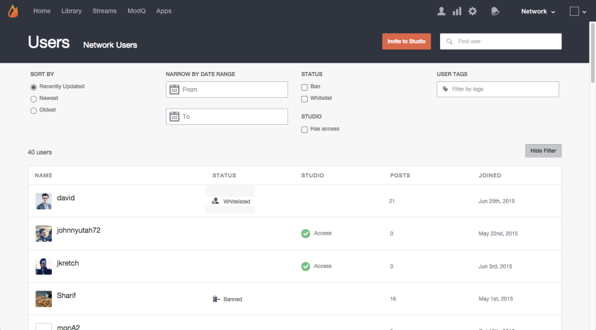

# Search for Users{#search-for-users}

Use the Search field at the top of the page to search for site visitors by Display Name, User ID, email address, or the date they joined your Livefyre network.

>[!NOTE]
>
>These fields support wildcard search.

1. Click **[!UICONTROL Show Filter]** to open a panel from which listed users may be filtered.
1. **[!UICONTROL Sort by]** updates to the listed User accounts: Recently Updated, Newest, or Oldest.
1. **[!UICONTROL Narrow by Date Range]** to list only user accounts added during the input range.
1. List only **[!UICONTROL Banned]** or **[!UICONTROL Whitelisted]** users.
1. List only **[!UICONTROL Studio]** users.
1. List only those accounts with the input **[!UICONTROL User Tags]** attached. 

